# Auth0 Setup

1. Visit <https://auth0.com>
   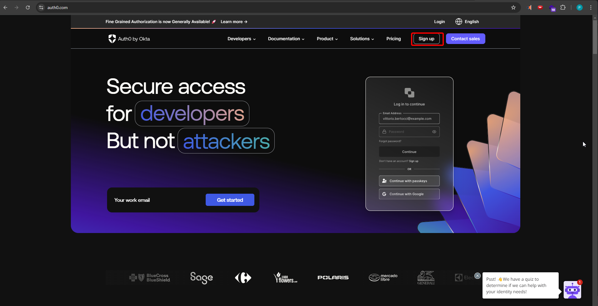
2. Log-in with your Google Account or whatever other provider you feel comfortable with
   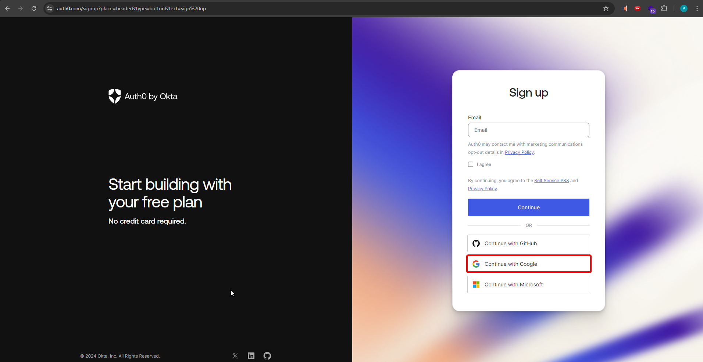
3. Accept terms and agreements
   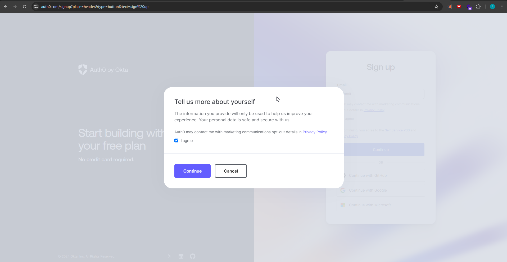
4. Choose an account
   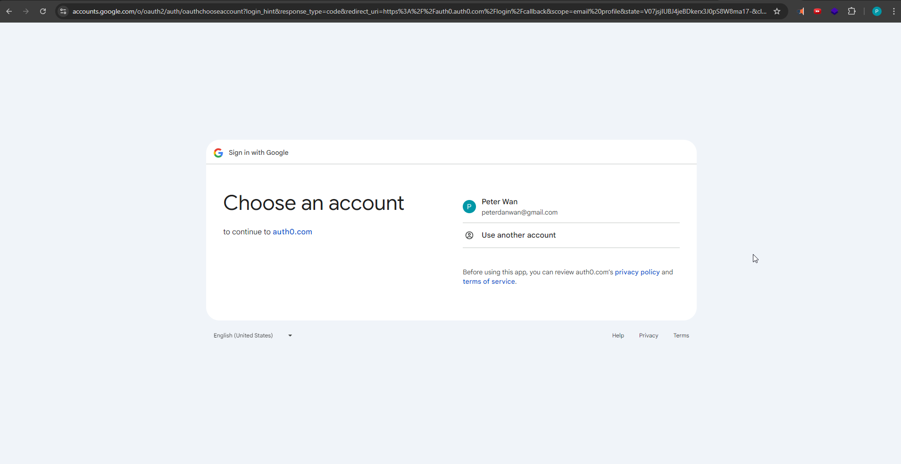
5. Sign in with `auth0`
   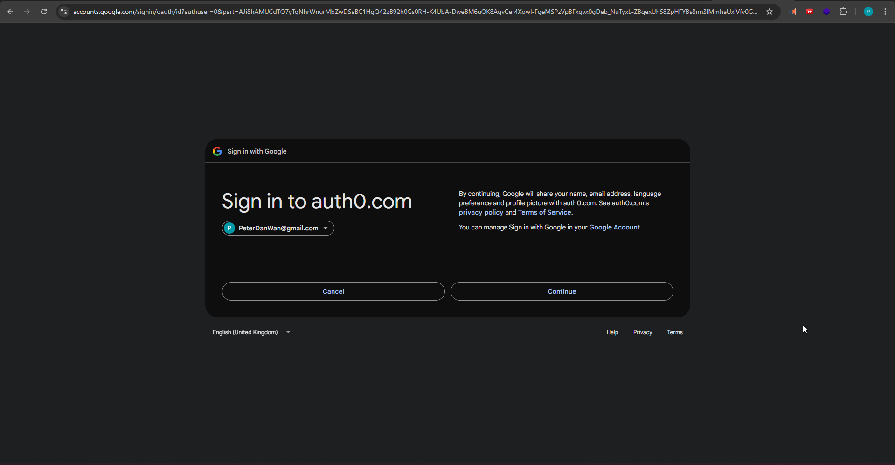
6. Choose the `Other` account type.
   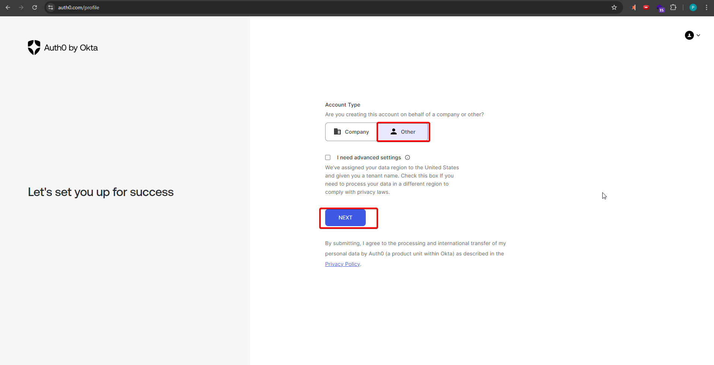
7. Create your application (in our case, it'll be `coursemetrics`)
   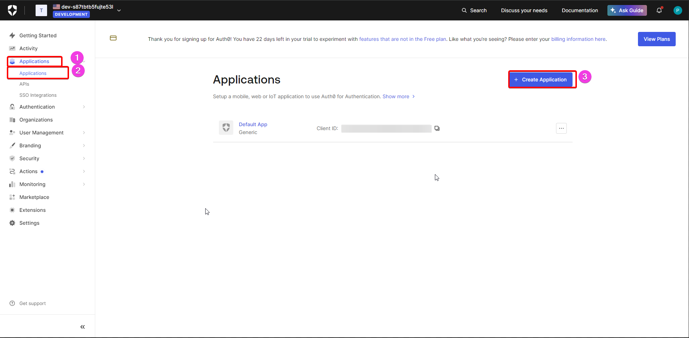
8. Ensure your application's type is `Regular Web Applications`
   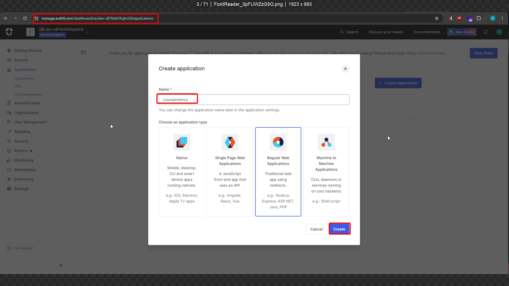
9. Select `Next.js` as our application's web technology.
   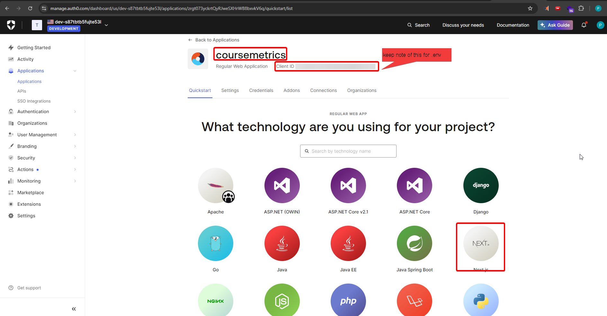
10. Update Settings of your application
    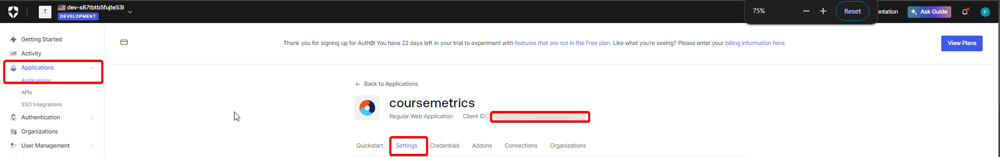
    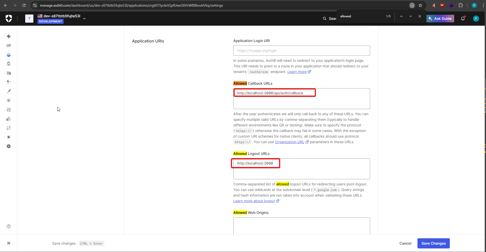
11. Follow the `quickstart` instructions (some things have already been added to our repo). Ensure you set up your _own_ `env.local` file.
    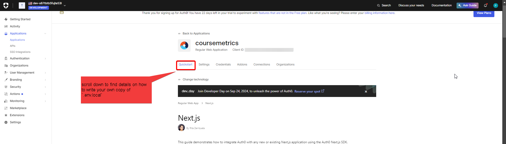
    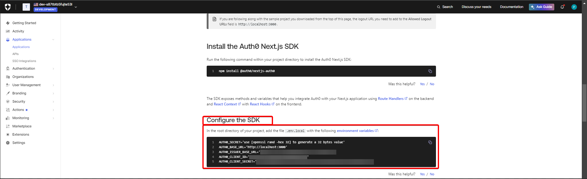
