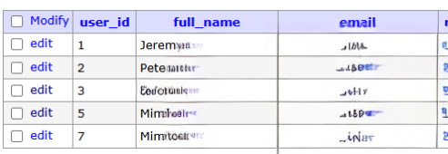
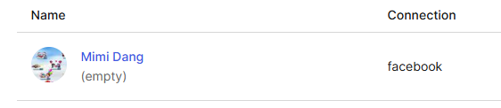
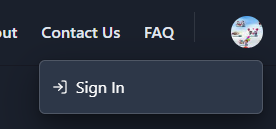

<!-- omit in toc -->
# Bug Report

<!-- omit in toc -->
## Bugs Found Summary

| Bug ID | Description                                          | Impact   | Severity | Status  | Link to GitHub Issue                 |
|--------|------------------------------------------------------|----------|----------|---------|--------------------------------------|
| 176    | [CourseMetrics Logo Route Back to Homepage](#coursemetrics-logo-route-back-to-homepage)            |  Low     | Minor      | Closed  | [#176](https://github.com/peterdanwan/coursemetrics/issues/176)  |
| 177    | [Footer Links Go from Light to Dark Mode](#footer-links-goes-from-light-to-dark-mode)              |  Low     | Minor   | Closed    | [#177](https://github.com/peterdanwan/coursemetrics/issues/177)   |
| 178    | [Weird Backend Increment of User ID in Database](#weird-backend-increment-of-user-id-in-database)       |  Low     | Minor     | Open    | [#178](https://github.com/peterdanwan/coursemetrics/issues/178)   |
| 179    | [Problem Signing In with Facebook that have no Email](#problem-signing-in-with-facebook-that-have-no-email)  |  Medium     | Critical     | Open    | [#179](https://github.com/peterdanwan/coursemetrics/issues/179) |

---
<!-- omit in toc -->
## Table of Contents
- [CourseMetrics Logo Route Back to Homepage](#coursemetrics-logo-route-back-to-homepage)
  - [1. Bug Description](#1-bug-description)
  - [2. Steps to Reproduce](#2-steps-to-reproduce)
  - [3. Expected Behavior](#3-expected-behavior)
  - [4. Actual Behavior](#4-actual-behavior)
  - [5. Environment Details](#5-environment-details)
  - [6. Screenshots / Logs (if applicable)](#6-screenshots--logs-if-applicable)
  - [7. Impact / Severity](#7-impact--severity)
  - [8. Suggested Fix / Workaround (if any)](#8-suggested-fix--workaround-if-any)
- [Footer Links Goes from Light to Dark Mode](#footer-links-goes-from-light-to-dark-mode)
  - [1. Bug Description](#1-bug-description-1)
  - [2. Steps to Reproduce](#2-steps-to-reproduce-1)
  - [3. Expected Behavior](#3-expected-behavior-1)
  - [4. Actual Behavior](#4-actual-behavior-1)
  - [5. Environment Details](#5-environment-details-1)
  - [6. Screenshots / Logs (if applicable)](#6-screenshots--logs-if-applicable-1)
  - [7. Impact / Severity](#7-impact--severity-1)
  - [8. Suggested Fix / Workaround (if any)](#8-suggested-fix--workaround-if-any-1)
- [Weird Backend Increment of User ID in Database](#weird-backend-increment-of-user-id-in-database)
  - [1. Bug Description](#1-bug-description-2)
  - [2. Steps to Reproduce](#2-steps-to-reproduce-2)
  - [3. Expected Behavior](#3-expected-behavior-2)
  - [4. Actual Behavior](#4-actual-behavior-2)
  - [5. Environment Details](#5-environment-details-2)
  - [6. Screenshots / Logs (if applicable)](#6-screenshots--logs-if-applicable-2)
  - [7. Impact / Severity](#7-impact--severity-2)
  - [8. Suggested Fix / Workaround (if any)](#8-suggested-fix--workaround-if-any-2)
- [Problem Signing In with Facebook that have no Email](#problem-signing-in-with-facebook-that-have-no-email)
  - [1. Bug Description](#1-bug-description-3)
  - [2. Steps to Reproduce](#2-steps-to-reproduce-3)
  - [3. Expected Behavior](#3-expected-behavior-3)
  - [4. Actual Behavior](#4-actual-behavior-3)
  - [5. Environment Details](#5-environment-details-3)
  - [6. Screenshots / Logs (if applicable)](#6-screenshots--logs-if-applicable-3)
  - [7. Impact / Severity](#7-impact--severity-3)
  - [8. Suggested Fix / Workaround (if any)](#8-suggested-fix--workaround-if-any-3)

---

## CourseMetrics Logo Route Back to Homepage

**Reported by**: Mimi Dang  
**Date reported**: 11/03/2024  
**Priority**: Low  
**Issue #**: [176](https://github.com/peterdanwan/coursemetrics/issues/176)  
**Status**: Closed

---

### 1. Bug Description
The CourseMetrics logo found in the navbar does not route back to the home page.

---

### 2. Steps to Reproduce
1. Go to CourseMetrics page: localhost:3000.
2. Click on the CourseMetrics Logo.
3. Notice that nothing happens after clicking the CourseMetrics logo.

---

### 3. Expected Behavior
After clicking the CourseMetrics logo, the user should be redirected to the home page.

---

### 4. Actual Behavior
The CourseMetrics logo appears to be unresponsive, and no action occurs when clicked.

---

### 5. Environment Details

- **OS**: Windows 10
- **Browser**: Chrome
- **Version**: "Local environment, no version deployed yet"
- **Device**: Desktop

---

### 6. Screenshots / Logs (if applicable)


---

### 7. Impact / Severity
- **Impact**: Low
- **Severity**: Minor

---

### 8. Suggested Fix / Workaround (if any)
A potential fix may be to add a route to the homepage for the logo:
```html
<Link href="/">
  <Image src={logo} priority alt="Course Metrics Logo" width={50} height={50} />
</Link>
```

## Footer Links Goes from Light to Dark Mode

**Reported by**: Mimi Dang  
**Date reported**: 11/03/2024  
**Priority**: Low  
**Issue #**: [177](https://github.com/peterdanwan/coursemetrics/issues/177)  
**Status**: Closed

---

### 1. Bug Description
When the Footer links are clicked, the page would first load to light mode and then to dark mode when our selected mode is dark.

---

### 2. Steps to Reproduce
1. Go to CourseMetrics page: localhost:3000.
2. Switch to Dark Mode by using the toggle.
3. Click on any of the Footer links.
4. Notice that the pages goes from light mode to dark mode.

---

### 3. Expected Behavior
After clicking any of the Footer links, the pages should load in dark mode when the user has toggled to dark mode.

---

### 4. Actual Behavior
After clicking on the Footer links, the pages load light mode to dark mode.

---

### 5. Environment Details

- **OS**: Windows 10
- **Browser**: Chrome
- **Version**: "Local environment, no version deployed yet"
- **Device**: Desktop

---

### 6. Screenshots / Logs (if applicable)
none

---

### 7. Impact / Severity
- **Impact**: Low
- **Severity**: Minor

---

### 8. Suggested Fix / Workaround (if any)
Instead of using the `Link` element from `@chakra-ui/reac`, use the one from `next/link`.

## Weird Backend Increment of User ID in Database

**Reported by**: Mimi Dang  
**Date reported**: 11/03/2024  
**Priority**: Low  
**Issue #**: [178](https://github.com/peterdanwan/coursemetrics/issues/178)  
**Status**: Open

---

### 1. Bug Description
When creating a new account, the incrementation of the user_id sometimes jump one number.

---

### 2. Steps to Reproduce
1. Go to CourseMetrics page: localhost:3000.
2. Go to Postgres Database: localhost:8080.
3. Input the proper credentials to access the database.
4. Go to the Sign In page.
5. Log in with a new account.
6. Check the Users table and check the user_id increment.
7. Sign out of the website.
8. Repeat step 4-7 multiple time.
9. Notice that the database increment the user_id by jumping some numbers.

---

### 3. Expected Behavior
When a new account is being created and stored in the database, the user_id should increment by 1.

---

### 4. Actual Behavior
The user_id sometimes increment by 1 and sometimes by 2.

---

### 5. Environment Details

- **OS**: Windows 10
- **Browser**: Chrome
- **Version**: "Local environment, no version deployed yet"
- **Device**: Desktop

---

### 6. Screenshots / Logs (if applicable)
From the database PostgresSQL: localhost:8080


---

### 7. Impact / Severity
- **Impact**: Low
- **Severity**: Minor

---

### 8. Suggested Fix / Workaround (if any)
Look back at the backend logic where you add a new user into the database and see if the incrementation add 1 to the user_id. Console.log everytime a new user is added in to see what is being passed to the database.


## Problem Signing In with Facebook that have no Email

**Reported by**: Mimi Dang  
**Date reported**: 11/03/2024  
**Priority**: Medium  
**Issue #**: [179](https://github.com/peterdanwan/coursemetrics/issues/179)  
**Status**: Open

---

### 1. Bug Description
When trying to sign in using Facebook with a Facebook account that do not share their email information or have signed in with a phone number, user does not see the profile menu and won't be able to add reviews. User can also no longer sign out, because only the sign in link is available.

---

### 2. Steps to Reproduce
1. Go to CourseMetrics page: localhost:3000.
2. Log in using Facebook that do not accept to share email information or have used a phone number to signed in.

---

### 3. Expected Behavior
When user signed in using a Facebook account, they should be able to see their profile menu, add reviews, and sign out properly.

---

### 4. Actual Behavior
User do not see their profile menu, can not add reviews, and do not see the sign out link. They are then stuck on the main home page and no routes are working.

---

### 5. Environment Details

- **OS**: Windows 10
- **Browser**: Chrome
- **Version**: "Local environment, no version deployed yet"
- **Device**: Desktop

---

### 6. Screenshots / Logs (if applicable)
  

As you can see, I have my facebook image there properly, but the profile menu is not there.  


---

### 7. Impact / Severity
- **Impact**: Medium
- **Severity**: Critical

---

### 8. Suggested Fix / Workaround (if any)
Have to change some configuration of Auth0 to be able to fetch the name and then from the backend, use the name, instead of the email to register a new user.
