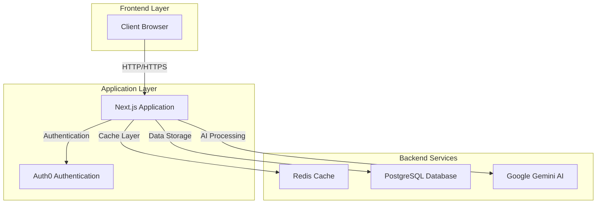
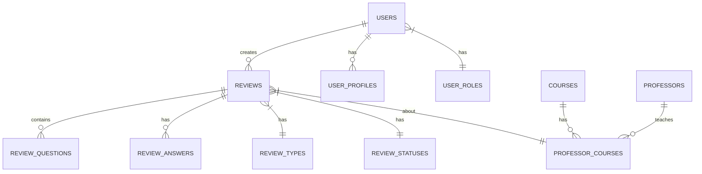
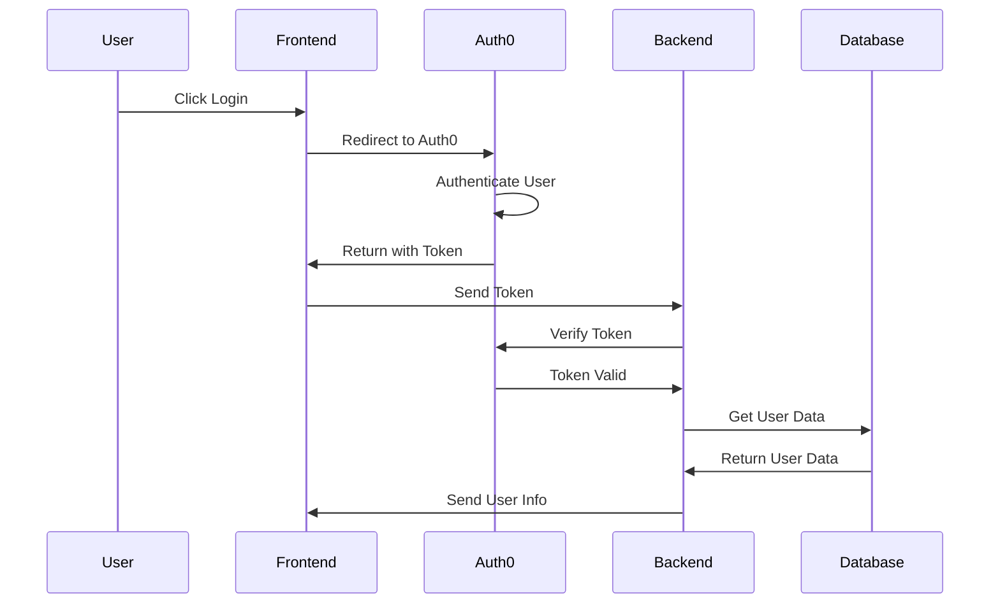
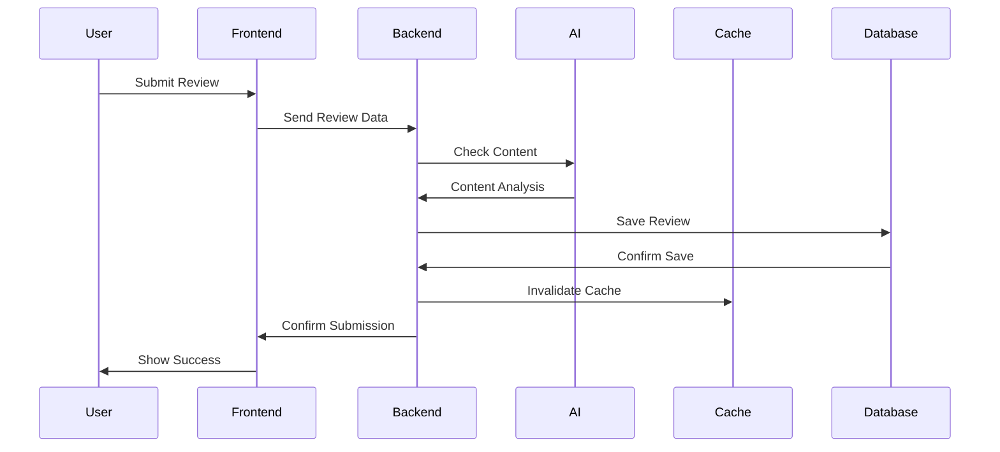
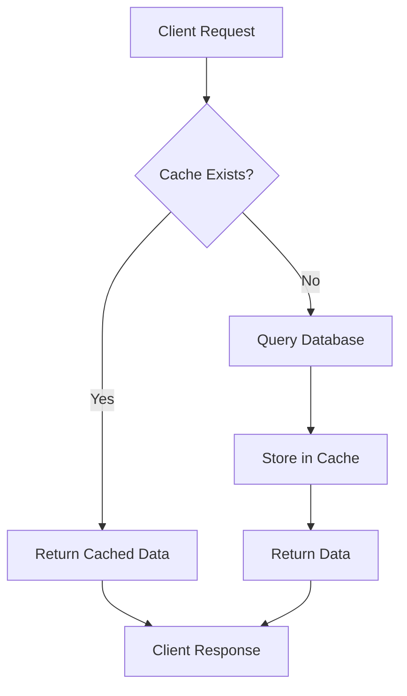
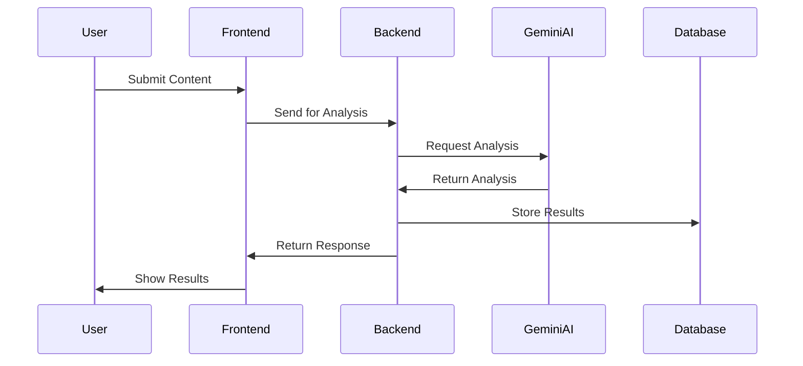

# Technical Manual

## Table of Contents

1. [System architecture and design diagrams](#1-system-architecture-and-design-diagrams)
2. [Explanation of core functionalities and modules](#2-explanation-of-core-functionalities-and-modules)
3. [API documentation](#3-api-documentation)
4. [Database schema](#4-database-schema) ✅
5. [Troubleshooting and error-handling details](#5-troubleshooting-and-error-handling-details)
6. [Instructions for scaling or enhancing the project](#6-instructions-for-scaling-or-enhancing-the-project)

## 1. System architecture and design diagrams

Activity Diagrams

## 2. Explanation of core functionalities and modules

## 3. API documentation

This document outlines all available API endpoints for the Course Review System.

### Authentication

#### Auth0 Routes

```typescript
GET / api / auth / login; // Perform login with Auth0
GET / api / auth / logout; // Log the user out
GET / api / auth / callback; // Auth0 redirect after successful login
GET / api / auth / me; // Fetch user profile
```

### Users

#### Create/Get User

```typescript
POST / api / users;
```

Creates a new user if they don't exist already.

**Response:**

- `200 OK` - User processed successfully
- `401 Unauthorized` - User not authenticated
- `500 Internal Server Error` - Server-side issue

```typescript
GET / api / users;
```

Retrieves user information including their reviews.

**Response:**

- `200 OK` - User data retrieved successfully
- `401 Unauthorized` - User not authenticated
- `404 Not Found` - User not found
- `500 Internal Server Error` - Server-side issue

### Courses

#### Get All Courses

```typescript
GET / api / courses;
```

Fetches all courses.

**Response:**

- `200 OK` - List of courses
- `500 Internal Server Error` - Server-side issue

#### Create Course

```typescript
POST / api / courses;
```

Creates a new course.

**Required Fields:**

- `course_code`
- `course_section`
- `course_name`
- `course_description`
- `course_delivery_format_id`
- `season`
- `year`

**Response:**

- `200 OK` - Course created successfully
- `400 Bad Request` - Missing required fields
- `409 Conflict` - Course already exists
- `500 Internal Server Error` - Server-side issue

#### Get Course by Code

```typescript
GET / api / courses / { courseCode };
```

Fetches course by course code.

**Query Parameters:**

- `season` (optional)
- `year` (optional)

**Response:**

- `200 OK` - Course details
- `404 Not Found` - Course not found
- `500 Internal Server Error` - Server-side issue

#### Get Course Delivery Formats

```typescript
GET / api / courses / courseDelivery;
```

Fetches course delivery formats.

**Query Parameters:**

- `format` (optional) - Filter by format name
- `id` (optional) - Filter by ID

**Response:**

- `200 OK` - List of delivery formats
- `500 Internal Server Error` - Server-side issue

### Professors

#### Get All Professors

```typescript
GET / api / professors;
```

Fetches all professors.

**Response:**

- `200 OK` - List of professors
- `500 Internal Server Error` - Server-side issue

#### Create Professor

```typescript
POST / api / professors;
```

Creates a new professor.

**Required Fields:**

- `first_name`
- `last_name`

**Response:**

- `201 Created` - Professor created successfully
- `400 Bad Request` - Missing required fields
- `409 Conflict` - Professor already exists
- `500 Internal Server Error` - Server-side issue

#### Get Professor by ID

```typescript
GET / api / professors / { professorId };
```

Fetches professor details and associated courses.

**Response:**

- `200 OK` - Professor details and courses
- `404 Not Found` - Professor not found
- `500 Internal Server Error` - Server-side issue

#### Get Professors by Course

```typescript
GET / api / professors / course / { courseCode };
```

Fetches professors teaching a specific course.

**Response:**

- `200 OK` - List of professors
- `404 Not Found` - No professors found
- `500 Internal Server Error` - Server-side issue

### Reviews

#### Get Course Reviews

```typescript
GET / api / reviews / courses / { courseCode };
```

Fetches reviews for a specific course.

**Query Parameters:**

- `season` (optional)
- `year` (optional)

**Response:**

- `200 OK` - Course reviews and tags
- `500 Internal Server Error` - Server-side issue

#### Create Course Review

```typescript
POST / api / reviews / courses / { courseCode };
```

Creates a new course review.

**Required Fields:**

- `professorId`
- `courseName`
- `term`
- `rating`
- `questions`

**Response:**

- `201 Created` - Review created successfully
- `400 Bad Request` - Missing required fields
- `401 Unauthorized` - User not authenticated
- `500 Internal Server Error` - Server-side issue

#### Get Professor Reviews

```typescript
GET / api / reviews / professors / { professorId };
```

Fetches reviews for a specific professor.

**Response:**

- `200 OK` - Professor reviews
- `500 Internal Server Error` - Server-side issue

#### Create Professor Review

```typescript
POST / api / reviews / professors / { professorId };
```

Creates a new professor review.

**Required Fields:**

- `courseName`
- `term`
- `questions`
- `commentTitle`
- `comment`
- `grade`

**Response:**

- `201 Created` - Review created successfully
- `400 Bad Request` - Missing required fields
- `401 Unauthorized` - User not authenticated
- `404 Not Found` - Professor/Course not found
- `500 Internal Server Error` - Server-side issue

### Questions

#### Get Questions

```typescript
GET / api / questions;
```

Fetches questions based on review type.

**Query Parameters:**

- `type` (required) - Review type ID

**Response:**

- `200 OK` - List of questions
- `400 Bad Request` - Missing review type
- `500 Internal Server Error` - Server-side issue

### Policies

#### Get Policies

```typescript
GET / api / policies;
```

Fetches all review policies.

**Response:**

- `200 OK` - List of policies
- `404 Not Found` - No policies found
- `500 Internal Server Error` - Server-side issue

### Error Responses

All endpoints may return the following error responses:

- `400 Bad Request` - Invalid request parameters
- `401 Unauthorized` - Authentication required
- `404 Not Found` - Resource not found
- `409 Conflict` - Resource already exists
- `500 Internal Server Error` - Server-side error

Each error response includes:

```json
{
  "error": {
    "code": number,
    "message": string
  }
}
```

### Success Responses

Successful responses include:

```json
{
  "data": {
    // Response data
  }
}
```

## 4. Database schema


## 5. Troubleshooting and error-handling details

### API

## Common Error Patterns

### Authentication Errors

#### 401 Unauthorized

```typescript
{
  "error": {
    "code": 401,
    "message": "User not authenticated"
  }
}
```

**Common Causes:**

- Auth0 session has expired
- Missing or invalid authentication token
- User trying to access protected routes without logging in

**Resolution Steps:**

1. Check if user is logged in via Auth0
2. Verify the session is still valid
3. Try logging out and logging back in
4. Check if the Auth0 configuration is correct in the environment variables

### Data Validation Errors

#### 400 Bad Request

```typescript
{
  "error": {
    "code": 400,
    "message": "Missing required fields"
  }
}
```

**Common Causes in Course Creation:**

- Missing required fields:
  - `course_code`
  - `course_section`
  - `course_name`
  - `course_description`
  - `course_delivery_format_id`
  - `season`
  - `year`

**Common Causes in Review Creation:**

- Missing required fields:
  - `professorId`
  - `courseName`
  - `term`
  - `rating`
  - `questions`

**Resolution Steps:**

1. Verify all required fields are included in the request body
2. Check field data types match the expected format
3. Ensure date formats are correct (if applicable)

### Database Conflicts

#### 409 Conflict

```typescript
{
  "error": {
    "code": 409,
    "message": "This course already exists"
  }
}
```

**Common Causes:**

- Attempting to create duplicate records
- Violating unique constraints
- Trying to delete records with existing relationships

**Resolution Steps:**

1. Check if the resource already exists
2. Use the `forceUpdate` flag if you need to override (for professors)
3. Remove dependent records before deleting parent records

### Resource Not Found

#### 404 Not Found

```typescript
{
  "error": {
    "code": 404,
    "message": "Resource not found"
  }
}
```

**Common Causes:**

- Invalid IDs in URL parameters
- Deleted or non-existent resources
- Incorrect course codes or professor IDs

**Resolution Steps:**

1. Verify the resource ID exists
2. Check for case sensitivity in course codes
3. Ensure the resource hasn't been deleted

## Transaction Handling

### Review Creation Transaction Flow

```typescript
try {
  const transaction = await sequelizeInstance.transaction();
  // Create review
  // Add questions and answers
  await transaction.commit();
} catch (error) {
  await transaction.rollback();
  // Handle error
}
```

**Troubleshooting Steps for Failed Transactions:**

1. Check database logs for deadlocks
2. Verify all required relationships exist
3. Ensure database connection is stable
4. Check for concurrent operations that might conflict

## Redis Cache Issues

### Cache Invalidation

```typescript
const redisKeyPattern = `reviews:${courseCode}:*`;
```

**Common Issues:**

- Stale data
- Cache miss
- Redis connection failures

**Resolution Steps:**

1. Clear Redis cache manually:

```bash
redis-cli KEYS "reviews:*" | xargs redis-cli DEL
```

2. Verify Redis connection settings
3. Check Redis memory usage
4. Monitor cache hit/miss rates

## Logging and Debugging

### Logger Implementation

```typescript
const log = logger.child({ module: 'app/api/route.ts' });

log.info('Operation description', { contextData });
log.error('Error description', { error });
```

**Debug Checklist:**

1. Check log levels are correctly set
2. Verify log output contains necessary context
3. Monitor error patterns in logs
4. Use transaction IDs for tracking requests

## Common Integration Points

### Auth0 Integration

```typescript
export const GET = handleAuth();
```

**Troubleshooting Steps:**

1. Verify Auth0 configuration
2. Check callback URLs
3. Validate token handling
4. Monitor Auth0 logs

### Database Connection

```typescript
await connectDB();
```

**Connection Issues:**

1. Check database credentials
2. Verify network connectivity
3. Monitor connection pool
4. Check for database locks

## Performance Optimization

### Query Optimization

```typescript
const reviews = await Review.findAll({
  include: [...],
  where: {...},
  attributes: [...],
});
```

**Performance Tips:**

1. Use selective column fetching
2. Implement pagination
3. Optimize JOIN operations
4. Use appropriate indexes

### Cache Strategy

```typescript
const cachedData = await redisClient.get(`reviews:${courseCode}:${season}:${year}`);
```

**Optimization Steps:**

1. Cache frequently accessed data
2. Implement cache warming
3. Set appropriate TTL values
4. Monitor cache size

## Environment-Specific Issues

### Development Environment

- Check `.env.local` configuration
- Verify development database connection
- Monitor development logs

### Production Environment

- Validate environment variables
- Check production database connection
- Monitor production logs
- Review error tracking service

## Security Considerations

### API Protection

1. Rate limiting
2. Input validation
3. SQL injection prevention
4. XSS protection

### Data Access

1. Role-based access control
2. Data encryption
3. Secure communication channels

## Monitoring and Alerts

### Key Metrics to Monitor

1. API response times
2. Error rates
3. Database connection pool
4. Cache hit/miss ratio
5. Authentication failures

### Alert Thresholds

1. High error rates (>1%)
2. Slow response times (>2s)
3. Database connection issues
4. Cache failures
5. Authentication spikes

## Support and Escalation

### Level 1 Support

- Basic troubleshooting
- Log analysis
- Common error resolution

### Level 2 Support

- Database issues
- Performance problems
- Integration failures

### Level 3 Support

- System architecture issues
- Security incidents
- Critical production issues
- [Authentication](#authentication)
- [Users](#users)
- [Courses](#courses)
- [Professors](#professors)
- [Reviews](#reviews)
- [Questions](#questions)
- [Policies](#policies)
  
## 6. Instructions for scaling or enhancing the project

**CourseMetrics** is a dynamic platform that needs robust scaling and enhancements to meet user demands and ensure long-term viability. Below is a detailed plan to scale the platform's infrastructure, enhance its features, and improve the overall user experience.

### Database Scaling

Effective database scaling ensures the platform can handle growing data volumes without performance degradation. Key steps include optimizing queries, leveraging caching, and improving data accessibility. Currently, Coursemetrics uses a combination of **PostgreSQL** and **Redis**.

- **Database Optimization**: Index frequently queried columns to accelerate lookups and implement table partitioning for large datasets like course reviews. For example, splitting the `reviews` table by year can improve query efficiency. Connection pooling will ensure resource management is robust, especially during peak traffic.
- **Redis Caching Enhancements**: Expand Redis caching to additional API endpoints, such as course recommendations. A strategy like cache warming can ensure frequently accessed data is readily available, minimizing latency.

*Example*: "Implementing a Redis cache for 'top courses' API reduced response time from 800ms to 120ms."

For more on database partitioning and caching, see [PostgreSQL Table Partitioning](https://www.postgresql.org/docs/current/ddl-partitioning.html) and [Redis Best Practices](https://redis.io/docs/manual/best-practices/).

### Application Scaling

Application scalability ensures smooth user experiences, even during high traffic. This involves performance optimization and infrastructure enhancements.

- **Performance Optimization**: Introduce server-side pagination for list views and lazy loading for images. By splitting JavaScript bundles and leveraging service workers, users will enjoy faster load times.
- **Infrastructure Scaling**: Configure auto-scaling groups to handle traffic spikes. For example, load balancers can distribute traffic across multiple instances, ensuring uptime during promotional campaigns. Adding a CDN will improve the delivery speed of static assets like course images.

*Example*: "After implementing auto-scaling, the system handled a Black Friday promotion with a 300% increase in traffic seamlessly."

Explore guides like [AWS Auto-Scaling](https://aws.amazon.com/autoscaling/) for more details.

### **Feature Enhancements**

Enhanced features drive user engagement and satisfaction. Key focus areas include authentication, review systems, and user experience.

- **Authentication & Authorization**: Introduce role-based access control (RBAC) to provide fine-grained permissions, such as differentiating between instructors and students. Adding two-factor authentication ensures account security.
- **Review System Improvements**: Enable rich-text formatting for reviews and integrate AI-powered sentiment analysis to highlight trending sentiments. A moderation queue will help maintain quality and appropriateness.
- **User Experience Enhancements**: Build a mobile app using React Native to extend the platform's reach. Accessibility features, like screen reader compatibility, will make the platform more inclusive.

*Example*: "Adding two-factor authentication led to a 40% decrease in account breaches."

For inspiration, check out [React Native Mobile Development](https://reactnative.dev/docs/getting-started).

### **API Enhancements**

APIs are the backbone of modern applications, requiring flexibility and reliability.

- **API Architecture**: Implement versioning (e.g., `v1/`) to ensure backward compatibility. GraphQL adoption can provide clients with more flexible data fetching.
- **Integration Features**: Add webhook support for real-time event notifications and API key management to improve security and enable advanced use cases.

*Example*: "Adding GraphQL allowed frontend teams to fetch only the required fields, reducing payload size by 60%."

Explore [GraphQL Documentation](https://graphql.org/learn/) for more information.

### **Security Enhancements**

Robust security measures protect user data and maintain platform trust.

- **Security Features**: Enforce CSRF protection and security headers. Regular security audits will help identify vulnerabilities.
- **Data Protection**: Implement encryption at rest and ensure GDPR compliance with clear data retention policies.

*Example*: "Encryption at rest helped the platform meet compliance for enterprise clients, unlocking new revenue streams."

Learn more about GDPR at [GDPR Compliance Guide](https://gdpr.eu/).

### **Testing and DevOps Improvements**

Testing and DevOps practices ensure smooth deployments and high-quality code.

- **Testing Infrastructure**: Use Cypress for end-to-end testing and integrate performance tests to identify bottlenecks.
- **CI/CD Enhancements**: Set up automated workflows for deployment with blue-green strategies to minimize downtime.

*Example*: "Blue-green deployments reduced deployment-related downtime to under 1 minute."

Visit [Cypress Testing](https://www.cypress.io/) and [GitHub Actions](https://docs.github.com/en/actions) to enhance your workflows.

### **Documentation and Maintenance**

Well-maintained documentation and proactive monitoring simplify onboarding and system upkeep.

- **Technical Documentation**: Create comprehensive guides and maintain API references using tools like Swagger/OpenAPI.
- **Code Quality and Performance Monitoring**: Use tools like Sentry for error tracking and implement benchmarks to monitor resource usage.

*Example*: "With OpenAPI documentation, third-party developers integrated with our API 25% faster."

Check out [Swagger OpenAPI](https://swagger.io/specification/) for effective API documentation strategies.

### **Next Steps**

- Prioritize features based on user needs and business value.
- Maintain backward compatibility where possible.
- Regularly test all enhancements to ensure reliability.

This guide provides a structured roadmap to scale and enhance CourseMetrics, ensuring it remains competitive and user-friendly.

### Scaling and Enhancing CourseMetrics  

**CourseMetrics** is a dynamic platform requiring robust scaling and enhancements to meet user demands and ensure long-term viability. Below is a concise plan to scale its infrastructure, enhance features, and improve the overall user experience.  

---

### Database Scaling  

Effective database scaling ensures **CourseMetrics** handles growing data volumes seamlessly, leveraging **PostgreSQL** and **Redis**.  

- **Database Optimization**: Add indexes to frequently queried columns and partition large tables like `reviews` for improved performance. Connection pooling optimizes resources during high traffic.  
- **Redis Caching**: Expand Redis to cache more endpoints like course recommendations. Implement cache warming to pre-load popular data for faster responses.  

*Example*: "Adding Redis caching for 'top courses' API cut response times from 800ms to 120ms."  

Learn more at [PostgreSQL Table Partitioning](https://www.postgresql.org/docs/current/ddl-partitioning.html) and [Redis Best Practices](https://redis.io/docs/manual/best-practices/).  

---

### Application Scaling  

Scalability ensures smooth user experiences, even with increased traffic.  

- **Performance**: Use server-side pagination and lazy loading for images to improve load times. Optimize JavaScript bundles with code splitting.  
- **Infrastructure**: Configure auto-scaling to handle traffic spikes, and use CDNs for faster delivery of static assets.  

*Example*: "Auto-scaling enabled the system to manage a 300% Black Friday traffic surge without downtime."  

See [AWS Auto-Scaling](https://aws.amazon.com/autoscaling/) for more details.  

---

### Feature Enhancements  

Improved features drive engagement and satisfaction.  

- **Authentication**: Add role-based access control (RBAC) and two-factor authentication for enhanced security.  
- **Review System**: Enable rich-text reviews and AI-powered sentiment analysis for insights.  
- **User Experience**: Develop a mobile app using React Native and enhance accessibility with screen-reader compatibility.  

*Example*: "Adding two-factor authentication reduced account breaches by 40%."  

Explore [React Native Mobile Development](https://reactnative.dev/docs/getting-started).  

---

### API Enhancements  

Flexible APIs ensure better integration and data management.  

- **Architecture**: Introduce versioning (e.g., `v1/`) and adopt GraphQL for more flexible data fetching.  
- **Integration**: Add webhooks for real-time notifications and API key management for secure access.  

*Example*: "Using GraphQL reduced payload sizes by 60%."  

Learn more at [GraphQL Documentation](https://graphql.org/learn/).  

---

### Security Enhancements  

Robust security measures protect data and build trust.  

- **Features**: Enforce CSRF protection, security headers, and regular security audits.  
- **Data Protection**: Encrypt data at rest and implement GDPR-compliant retention policies.  

*Example*: "Encryption at rest enabled compliance with enterprise clients, unlocking new markets."  

Refer to [GDPR Compliance Guide](https://gdpr.eu/).  

### Testing and DevOps  

Reliable deployments and high-quality code are critical.  

- **Testing**: Use Cypress for end-to-end testing and automate performance testing to identify bottlenecks.  
- **CI/CD**: Implement blue-green deployments to reduce downtime.  

*Example*: "Blue-green deployments minimized downtime to under 1 minute."  

Check [Cypress Testing](https://www.cypress.io/) and [GitHub Actions](https://docs.github.com/en/actions).  

### Documentation and Maintenance  

Clear documentation simplifies onboarding, and proactive monitoring ensures reliability.  

- **Technical Docs**: Maintain API references with tools like Swagger/OpenAPI.  
- **Monitoring**: Use Sentry for error tracking and set performance benchmarks.  

*Example*: "OpenAPI documentation reduced integration time for partners by 25%."  

See [Swagger OpenAPI](https://swagger.io/specification/).  

### Next Steps  

- Focus on high-impact features based on user needs.  
- Ensure backward compatibility and thorough testing.  
- Keep documentation and monitoring updated.  

This roadmap equips **CourseMetrics** to scale efficiently, enhance usability, and remain competitive.

### System Overview



## Database Schema Overview



## Authentication Flow



## Review Creation Flow



## Caching Strategy



## AI Integration Flow


