# Technical Manual

## Table of Contents

1. [System architecture and design diagrams](#1-system-architecture-and-design-diagrams)
2. [Explanation of core functionalities and modules](#2-explanation-of-core-functionalities-and-modules)
3. [API documentation](#3-api-documentation)
4. [Database schema](#4-database-schema)
5. [Troubleshooting and error-handling details](#5-troubleshooting-and-error-handling-details)
6. [Instructions for scaling or enhancing the project](#6-instructions-for-scaling-or-enhancing-the-project)

## 1. System architecture and design diagrams

### System Overview

This architecture integrates a Next.js application as the primary frontend and backend framework. Users access the platform via a client browser, which interacts with the application through HTTP/HTTPS. Auth0 handles user authentication, providing a secure and scalable solution for identity management. Data is cached in Redis to improve response times for frequently accessed information, while PostgreSQL serves as the primary database for persistent data storage. For advanced functionalities like content analysis and personalized recommendations, Google Gemini AI is utilized. The system is divided into three distinct layers: the frontend layer (user interface), the application layer (business logic), and the backend services (data management and AI processing).


## Authentication Flow

The authentication flow ensures secure user login. When a user clicks Login on the frontend, they are redirected to Auth0, which handles authentication. Upon successful login, Auth0 provides a token that the frontend sends to the backend for validation. The backend verifies the token with Auth0 to confirm its authenticity. Once validated, the backend queries the database for user-specific information and sends it back to the frontend. This flow ensures a seamless login experience while maintaining security through token-based authentication.


## Review Creation Flow

The review creation process captures user feedback while ensuring quality and performance. When a user submits a review, the frontend sends the data to the backend. The backend forwards the content to an AI system (e.g., Google Gemini) for analysis, such as sentiment or spam detection. After receiving the analysis results, the backend saves the review in the database. The cache is then invalidated to ensure updated information for future queries. The backend confirms the submission to the frontend, which notifies the user of success. This flow combines robust validation and real-time updates for an enhanced user experience.


## Caching Strategy

The caching strategy minimizes database load and improves response times. When a client makes a request, the system first checks if the data is already in the cache. If the cache contains the data, it is returned directly to the client. If not, the system queries the database, stores the resulting data in the cache, and then returns it to the client. This approach ensures quick access to frequently used data while maintaining accuracy through cache invalidation strategies.


## AI Integration Flow

AI powers intelligent features like content analysis and personalized recommendations. When a user submits content, the frontend sends it to the backend, which forwards the request to Google Gemini AI. The AI processes the content, providing analysis or recommendations that the backend stores in the database for future use. The backend then returns the AI-generated results to the frontend, which displays them to the user. This flow leverages advanced AI capabilities to enhance the platform's functionality and user experience.

```mermaid
sequenceDiagram
    participant User
    participant Frontend
    participant Backend
    participant GeminiAI
    participant Database

    User->>Frontend: Submit Content
    Frontend->>Backend: Send for Analysis
    Backend->>GeminiAI: Request Analysis
    GeminiAI->>Backend: Return Analysis
    Backend->>Database: Store Results
    Backend->>Frontend: Return Response
    Frontend->>User: Show Results
```



## 2. Explanation of core functionalities and modules

### `app` folder

Core application folder containing pages and routing logic

### `app/api` folder

API routes handling data operations

- `courses/`: Course-related API endpoints
- `reviews/`: Review management endpoints
- `professors/`: Professor data endpoints
- `admin/`: Protected administrative endpoints
- `auth/`: Authentication-related endpoints

### `app/admin` folder

Administrative interface and management tools

- `manage/`: Course and professor management
- `reviews/`: Review moderation interface
- `users/`: User management dashboard
- `stats/`: System statistics and analytics

### `components` folder

Reusable React components

### `database` folder

Database configuration and models

- `connectDB.ts`: Database connection setup
- `sequelizeInstance.ts`: Sequelize ORM configuration
- `redisInstance.ts`: Redis cache configuration
- `models/`: Database models
  - `Course.ts`: Course model
  - `Professor.ts`: Professor model
  - `Review.ts`: Review model
  - `User.ts`: User model
  - Additional related models

### `database/seedDB` folder

Database seeding scripts

- `index.ts`: Main seeding orchestration
- `seedCourses.ts`: Course data seeding
- `seedProfessors.ts`: Professor data seeding
- `seedReviews.ts`: Sample review data
- `seedUsers.ts`: User account seeding
- Additional seeding scripts for other models

### `styles` folder

Styling configurations and theme

- `theme.ts`: ChakraUI theme customization
- `styles.ts`: Shared style utilities
- Additional style configurations

### `utils` folder

Utility functions and helpers

- `api.ts`: API fetching utilities
- `logger.ts`: Logging configuration
- `response.ts`: API response formatters
- `ai.ts`: AI integration utilities
- `funcs.ts`: General utility functions

### `public` folder

Static assets and resources

- `images/`: Image assets
- `icons/`: Icon assets
- Additional static files

### Configuration Files

Project configuration and setup

- `next.config.mjs`: Next.js configuration
- `package.json`: Project dependencies
- `tsconfig.json`: TypeScript configuration
- `docker-compose.yml`: Docker configuration
- `.env.local`: Environment variables
- `.prettierrc`: Code formatting rules
- `.eslintrc`: Linting configuration

### Documentation Files

Project documentation

- `README.md`: Project overview
- `ARCHITECTURE.md`: System architecture
- `SCALING.md`: Scaling instructions
- `LICENSE`: Project license
- Additional documentation in `_documents/`

### Development Configuration

Development tooling setup

- `.vscode/`: VS Code settings
- `.github/`: GitHub workflows
- `.husky/`: Git hooks
- `.gitignore`: Git ignore rules

This structure follows a modular organization that separates concerns and makes the codebase maintainable and scalable. Each folder has a specific purpose and contains related files, making it easier for developers to locate and modify components of the system.

Here is the API documentation with inputs, query parameters, and response details laid out in a cleaner and structured format, similar to your original style, but now with a table format for better presentation:

## 3. API Documentation

This document outlines all available API endpoints for the **Course Review System**.

### Authentication

#### Auth0 Routes

| **Route**                         | **Description**                                 |
|-----------------------------------|-------------------------------------------------|
| `GET /api/auth/login`             | Perform login with Auth0.                      |
| `GET /api/auth/logout`            | Log the user out.                              |
| `GET /api/auth/callback`          | Auth0 redirect after successful login.         |
| `GET /api/auth/me`                | Fetch the user profile.                        |

### Users

#### Create/Get User

| **Route**                         | **Description**                                 | **Response**                                      |
|-----------------------------------|-------------------------------------------------|--------------------------------------------------|
| `POST /api/users`                 | Creates a new user if they don't exist already. | `200 OK` - User processed successfully<br> `401 Unauthorized` - User not authenticated<br> `500 Internal Server Error` - Server-side issue |
| `GET /api/users`                  | Retrieves user information, including reviews.  | `200 OK` - User data retrieved successfully<br> `401 Unauthorized` - User not authenticated<br> `404 Not Found` - User not found<br> `500 Internal Server Error` - Server-side issue |

### Courses

#### Get All Courses

| **Route**                         | **Description**                                 | **Response**                                      |
|-----------------------------------|-------------------------------------------------|--------------------------------------------------|
| `GET /api/courses`                | Fetches all courses.                           | `200 OK` - List of courses<br> `500 Internal Server Error` - Server-side issue |

#### Create Course

| **Route**                         | **Description**                                 | **Required Fields**                               | **Response**                                      |
|-----------------------------------|-------------------------------------------------|--------------------------------------------------|--------------------------------------------------|
| `POST /api/courses`               | Creates a new course.                           | `course_code`, `course_section`, `course_name`, `course_description`, `course_delivery_format_id`, `season`, `year` | `200 OK` - Course created successfully<br> `400 Bad Request` - Missing required fields<br> `409 Conflict` - Course already exists<br> `500 Internal Server Error` - Server-side issue |

#### Get Course by Code

| **Route**                         | **Description**                                 | **Query Parameters**                              | **Response**                                      |
|-----------------------------------|-------------------------------------------------|--------------------------------------------------|--------------------------------------------------|
| `GET /api/courses/{courseCode}`   | Fetches course by course code.                  | `season` (optional), `year` (optional)           | `200 OK` - Course details<br> `404 Not Found` - Course not found<br> `500 Internal Server Error` - Server-side issue |

#### Get Course Delivery Formats

| **Route**                         | **Description**                                 | **Query Parameters**                              | **Response**                                      |
|-----------------------------------|-------------------------------------------------|--------------------------------------------------|--------------------------------------------------|
| `GET /api/courses/courseDelivery` | Fetches course delivery formats.               | `format` (optional) - Filter by format name<br> `id` (optional) - Filter by ID | `200 OK` - List of delivery formats<br> `500 Internal Server Error` - Server-side issue |

### Professors

#### Get All Professors

| **Route**                         | **Description**                                 | **Response**                                      |
|-----------------------------------|-------------------------------------------------|--------------------------------------------------|
| `GET /api/professors`             | Fetches all professors.                         | `200 OK` - List of professors<br> `500 Internal Server Error` - Server-side issue |

#### Create Professor

| **Route**                         | **Description**                                 | **Required Fields**                               | **Response**                                      |
|-----------------------------------|-------------------------------------------------|--------------------------------------------------|--------------------------------------------------|
| `POST /api/professors`            | Creates a new professor.                        | `first_name`, `last_name`                        | `201 Created` - Professor created successfully<br> `400 Bad Request` - Missing required fields<br> `409 Conflict` - Professor already exists<br> `500 Internal Server Error` - Server-side issue |

#### Get Professor by ID

| **Route**                         | **Description**                                 | **Response**                                      |
|-----------------------------------|-------------------------------------------------|--------------------------------------------------|
| `GET /api/professors/{professorId}` | Fetches professor details and associated courses. | `200 OK` - Professor details and courses<br> `404 Not Found` - Professor not found<br> `500 Internal Server Error` - Server-side issue |

#### Get Professors by Course

| **Route**                         | **Description**                                 | **Response**                                      |
|-----------------------------------|-------------------------------------------------|--------------------------------------------------|
| `GET /api/professors/course/{courseCode}` | Fetches professors teaching a specific course. | `200 OK` - List of professors<br> `404 Not Found` - No professors found<br> `500 Internal Server Error` - Server-side issue |

### Reviews

#### Get Course Reviews

| **Route**                         | **Description**                                 | **Query Parameters**                              | **Response**                                      |
|-----------------------------------|-------------------------------------------------|--------------------------------------------------|--------------------------------------------------|
| `GET /api/reviews/courses/{courseCode}` | Fetches reviews for a specific course.       | `season` (optional), `year` (optional)           | `200 OK` - Course reviews and tags<br> `500 Internal Server Error` - Server-side issue |

#### Create Course Review

| **Route**                         | **Description**                                 | **Required Fields**                               | **Response**                                      |
|-----------------------------------|-------------------------------------------------|--------------------------------------------------|--------------------------------------------------|
| `POST /api/reviews/courses/{courseCode}` | Creates a new course review.                  | `professorId`, `courseName`, `term`, `rating`, `questions` | `201 Created` - Review created successfully<br> `400 Bad Request` - Missing required fields<br> `401 Unauthorized` - User not authenticated<br> `500 Internal Server Error` - Server-side issue |

#### Get Professor Reviews

| **Route**                         | **Description**                                 | **Response**                                      |
|-----------------------------------|-------------------------------------------------|--------------------------------------------------|
| `GET /api/reviews/professors/{professorId}` | Fetches reviews for a specific professor.     | `200 OK` - Professor reviews<br> `500 Internal Server Error` - Server-side issue |

#### Create Professor Review

| **Route**                         | **Description**                                 | **Required Fields**                               | **Response**                                      |
|-----------------------------------|-------------------------------------------------|--------------------------------------------------|--------------------------------------------------|
| `POST /api/reviews/professors/{professorId}` | Creates a new professor review.                | `courseName`, `term`, `questions`, `commentTitle`, `comment`, `grade` | `201 Created` - Review created successfully<br> `400 Bad Request` - Missing required fields<br> `401 Unauthorized` - User not authenticated<br> `404 Not Found` - Professor/Course not found<br> `500 Internal Server Error` - Server-side issue |

### Questions

#### Get Questions

| **Route**                         | **Description**                                 | **Query Parameters**                              | **Response**                                      |
|-----------------------------------|-------------------------------------------------|--------------------------------------------------|--------------------------------------------------|
| `GET /api/questions`              | Fetches questions based on review type.         | `type` (required) - Review type ID               | `200 OK` - List of questions<br> `400 Bad Request` - Missing review type<br> `500 Internal Server Error` - Server-side issue |

### Policies

#### Get Policies

| **Route**                         | **Description**                                 | **Response**                                      |
|-----------------------------------|-------------------------------------------------|--------------------------------------------------|
| `GET /api/policies`              | Fetches all review policies.                    | `200 OK` - List of policies<br> `404 Not Found` - No policies found<br> `500 Internal Server Error` - Server-side issue |

### Error Responses

All endpoints may return the following error responses:

| **Status Code** | **Message**                |
|-----------------|----------------------------|
| `400`           | Invalid request parameters |
| `401`           | Authentication required    |
| `404`           | Resource not found         |
| `409`           | Resource already exists    |
| `500`           | Server-side error          |

Each error response includes:

```json
{
  "error": {
    "code": number,
    "message": string
  }
}
```

### Success Responses

Successful responses include:

```json
{
  "data": {
    // Response data
  }
}
```

## 4. Database schema


## 5. Troubleshooting and error-handling details

### Authentication Errors

#### 401 Unauthorized

```typescript
{
  "error": {
    "code": 401,
    "message": "User not authenticated"
  }
}
```

**Common Causes:**

- Auth0 session has expired
- Missing or invalid authentication token
- User trying to access protected routes without logging in

**Resolution Steps:**

1. Check if user is logged in via Auth0
2. Verify the session is still valid
3. Try logging out and logging back in
4. Check if the Auth0 configuration is correct in the environment variables

### Data Validation Errors

#### 400 Bad Request

```typescript
{
  "error": {
    "code": 400,
    "message": "Missing required fields"
  }
}
```

**Common Causes in Course Creation:**

- Missing required fields:
  - `course_code`
  - `course_section`
  - `course_name`
  - `course_description`
  - `course_delivery_format_id`
  - `season`
  - `year`

**Common Causes in Review Creation:**

- Missing required fields:
  - `professorId`
  - `courseName`
  - `term`
  - `rating`
  - `questions`

**Resolution Steps:**

1. Verify all required fields are included in the request body
2. Check field data types match the expected format
3. Ensure date formats are correct (if applicable)

### Database Conflicts

#### 409 Conflict

```typescript
{
  "error": {
    "code": 409,
    "message": "This course already exists"
  }
}
```

**Common Causes:**

- Attempting to create duplicate records
- Violating unique constraints
- Trying to delete records with existing relationships

**Resolution Steps:**

1. Check if the resource already exists
2. Use the `forceUpdate` flag if you need to override (for professors)
3. Remove dependent records before deleting parent records

### Resource Not Found

#### 404 Not Found

```typescript
{
  "error": {
    "code": 404,
    "message": "Resource not found"
  }
}
```

**Common Causes:**

- Invalid IDs in URL parameters
- Deleted or non-existent resources
- Incorrect course codes or professor IDs

**Resolution Steps:**

1. Verify the resource ID exists
2. Check for case sensitivity in course codes
3. Ensure the resource hasn't been deleted

### Transaction Handling

#### Review Creation Transaction Flow

```typescript
try {
  const transaction = await sequelizeInstance.transaction();
  // Create review
  // Add questions and answers
  await transaction.commit();
} catch (error) {
  await transaction.rollback();
  // Handle error
}
```

**Troubleshooting Steps for Failed Transactions:**

1. Check database logs for deadlocks
2. Verify all required relationships exist
3. Ensure database connection is stable
4. Check for concurrent operations that might conflict

### Redis Cache Issues

#### Cache Invalidation

```typescript
const redisKeyPattern = `reviews:${courseCode}:*`;
```

**Common Issues:**

- Stale data
- Cache miss
- Redis connection failures

**Resolution Steps:**

1. Clear Redis cache manually:

    ```bash
    redis-cli KEYS "reviews:*" | xargs redis-cli DEL
    ```

2. Verify Redis connection settings
3. Check Redis memory usage
4. Monitor cache hit/miss rates

### Logging and Debugging

#### Logger Implementation

```typescript
const log = logger.child({ module: 'app/api/route.ts' });

log.info('Operation description', { contextData });
log.error('Error description', { error });
```

**Debug Checklist:**

1. Check log levels are correctly set
2. Verify log output contains necessary context
3. Monitor error patterns in logs
4. Use transaction IDs for tracking requests

### Common Integration Points

#### Auth0 Integration

```typescript
export const GET = handleAuth();
```

**Troubleshooting Steps:**

1. Verify Auth0 configuration
2. Check callback URLs
3. Validate token handling
4. Monitor Auth0 logs

### Database Connection

```typescript
await connectDB();
```

**Connection Issues:**

1. Check database credentials
2. Verify network connectivity
3. Monitor connection pool
4. Check for database locks

### Performance Optimization

#### Query Optimization

```typescript
const reviews = await Review.findAll({
  include: [...],
  where: {...},
  attributes: [...],
});
```

**Performance Tips:**

1. Use selective column fetching
2. Implement pagination
3. Optimize JOIN operations
4. Use appropriate indexes

### Cache Strategy

```typescript
const cachedData = await redisClient.get(`reviews:${courseCode}:${season}:${year}`);
```

## 6. Instructions for scaling or enhancing the project

**CourseMetrics** is a dynamic platform that needs robust scaling and enhancements to meet user demands and ensure long-term viability. Below is a detailed plan to scale the platform's infrastructure, enhance its features, and improve the overall user experience.

### Database Scaling

Effective database scaling ensures the platform can handle growing data volumes without performance degradation. Key steps include optimizing queries, leveraging caching, and improving data accessibility. Currently, Coursemetrics uses a combination of **PostgreSQL** and **Redis**.

- **Database Optimization**: Index frequently queried columns to accelerate lookups and implement table partitioning for large datasets like course reviews. For example, splitting the `reviews` table by year can improve query efficiency. Connection pooling will ensure resource management is robust, especially during peak traffic.
- **Redis Caching Enhancements**: Expand Redis caching to additional API endpoints, such as course recommendations. A strategy like cache warming can ensure frequently accessed data is readily available, minimizing latency.

*Example*: "Implementing a Redis cache for 'top courses' API reduced response time from 800ms to 120ms."

For more on database partitioning and caching, see [PostgreSQL Table Partitioning](https://www.postgresql.org/docs/current/ddl-partitioning.html) and [Redis Best Practices](https://redis.io/docs/manual/best-practices/).

### Application Scaling

Application scalability ensures smooth user experiences, even during high traffic. This involves performance optimization and infrastructure enhancements.

- **Performance Optimization**: Introduce server-side pagination for list views and lazy loading for images. By splitting JavaScript bundles and leveraging service workers, users will enjoy faster load times.
- **Infrastructure Scaling**: Configure auto-scaling groups to handle traffic spikes. For example, load balancers can distribute traffic across multiple instances, ensuring uptime during promotional campaigns. Adding a CDN will improve the delivery speed of static assets like course images.

*Example*: "After implementing auto-scaling, the system handled a Black Friday promotion with a 300% increase in traffic seamlessly."

Explore guides like [AWS Auto-Scaling](https://aws.amazon.com/autoscaling/) for more details.

### Feature Enhancements

Enhanced features drive user engagement and satisfaction. Key focus areas include authentication, review systems, and user experience.

- **Authentication & Authorization**: Introduce role-based access control (RBAC) to provide fine-grained permissions, such as differentiating between instructors and students. Adding two-factor authentication ensures account security.
- **Review System Improvements**: Enable rich-text formatting for reviews and integrate AI-powered sentiment analysis to highlight trending sentiments. A moderation queue will help maintain quality and appropriateness.
- **User Experience Enhancements**: Build a mobile app using React Native to extend the platform's reach. Accessibility features, like screen reader compatibility, will make the platform more inclusive.

*Example*: "Adding two-factor authentication led to a 40% decrease in account breaches."

For inspiration, check out [React Native Mobile Development](https://reactnative.dev/docs/getting-started).

### API Enhancements

APIs are the backbone of modern applications, requiring flexibility and reliability.

- **API Architecture**: Implement versioning (e.g., `v1/`) to ensure backward compatibility. GraphQL adoption can provide clients with more flexible data fetching.
- **Integration Features**: Add webhook support for real-time event notifications and API key management to improve security and enable advanced use cases.

*Example*: "Adding GraphQL allowed frontend teams to fetch only the required fields, reducing payload size by 60%."

Explore [GraphQL Documentation](https://graphql.org/learn/) for more information.

### Security Enhancements

Robust security measures protect user data and maintain platform trust.

- **Security Features**: Enforce CSRF protection and security headers. Regular security audits will help identify vulnerabilities.
- **Data Protection**: Implement encryption at rest and ensure GDPR compliance with clear data retention policies.

*Example*: "Encryption at rest helped the platform meet compliance for enterprise clients, unlocking new revenue streams."

Learn more about GDPR at [GDPR Compliance Guide](https://gdpr.eu/).

### Testing and DevOps Improvements

Testing and DevOps practices ensure smooth deployments and high-quality code.

- **Testing Infrastructure**: Use Cypress for end-to-end testing and integrate performance tests to identify bottlenecks.
- **CI/CD Enhancements**: Set up automated workflows for deployment with blue-green strategies to minimize downtime.

*Example*: "Blue-green deployments reduced deployment-related downtime to under 1 minute."

Visit [Cypress Testing](https://www.cypress.io/) and [GitHub Actions](https://docs.github.com/en/actions) to enhance your workflows.

### Documentation and Maintenance

Well-maintained documentation and proactive monitoring simplify onboarding and system upkeep.

- **Technical Documentation**: Create comprehensive guides and maintain API references using tools like Swagger/OpenAPI.
- **Code Quality and Performance Monitoring**: Use tools like Sentry for error tracking and implement benchmarks to monitor resource usage.

*Example*: "With OpenAPI documentation, third-party developers integrated with our API 25% faster."

Check out [Swagger OpenAPI](https://swagger.io/specification/) for effective API documentation strategies.

### Next Steps

- Prioritize features based on user needs and business value.
- Maintain backward compatibility where possible.
- Regularly test all enhancements to ensure reliability.
